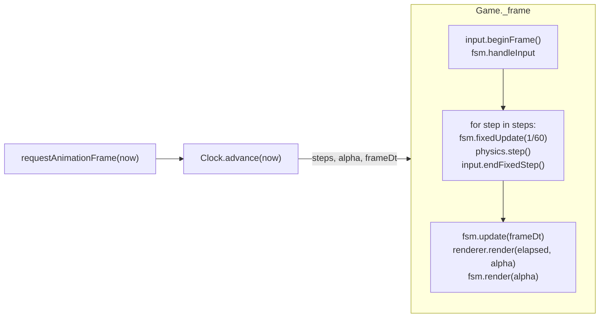

# Le PiliPili — Technical Architecture Blueprint

> A saturated neon-crimson **2.5D club platformer** built on **Three.js + Rapier2D
> (WASM)** with a **pmndrs/postprocessing** screen pipeline. Gameplay resolves on
> a 2D plane; the third dimension buys parallax, depth-of-field neon, and a
> genuinely 3D skull-booth boss.

This document is the map. It explains *why* each seam exists, so a new engineer
can find the one file they need to touch and change it without fear.

---

## 1. Design pillars → engineering consequences

| Pillar (client brief) | What it forces in the architecture |
| --- | --- |
| **Tight, modern game-feel** | A hand-integrated **kinematic** player (coyote/buffer/asymmetric gravity/apex hang), never a rigid body. Fixed 60 Hz sim with render interpolation so feel is identical on every machine. |
| **Growth loop that alters physics** | A **weight model** derived from a spring-interpolated scale; every locomotion stat is a function of weight, and the collider resizes clearance-safe from the feet. |
| **Saturated crimson / neon / heavy post** | An **HDR render target** so emissive neon exceeds 1.0, feeding a merged post stack: bloom → chromatic aberration → custom crimson-grade GLSL → ACES, then boss distortion (shockwaves, glitch) and a CRT overlay. |
| **Rhythm boss** | A **deterministic BeatClock** ticked in the fixed step, so every telegraph and shockwave is frame-perfect on the beat and reproducible. |
| **Modularity / production-ready** | Systems talk only through an **EventBus** and a **shared ctx**; entities opt into a single **interaction contract**; every felt number lives in `Constants.js`. |

---

## 2. The loop: fixed simulation, interpolated render

The single most important structural decision. `Clock.js` runs the simulation in
**fixed 1/60 s steps** and renders with an **interpolation alpha** between the
last two sim states. Variable-delta physics would make jump height depend on
frame rate — unshippable.



- **Hitstop** lives in the Clock: on a big hit it eats real time *without*
  producing sim steps, so gameplay freezes for a few juicy milliseconds while
  shaders keep animating.
- **Spiral-of-death guard**: at most `MAX_SUBSTEPS` steps per frame; excess time
  is dropped, never accrued.
- Coyote-time and jump-buffer are counted in **fixed steps** (`input.endFixedStep`
  advances their clock), so "6 frames" means 6 sim frames regardless of FPS.

---

## 3. Folder structure

```
pilipili/
├─ index.html                # canvas + #ui overlay + boot splash
├─ vite.config.js            # base:'./', pre-bundles rapier/three/postprocessing
├─ package.json              # three ^0.171, @dimforge/rapier2d-compat ^0.14, postprocessing ^6.36
├─ docs/ARCHITECTURE.md      # ← you are here
└─ src/
   ├─ main.js                # bootstrap: await Game.init(), start loop
   ├─ config/
   │  ├─ Constants.js        # ★ single source of every FELT number + EVENT/LAYER/ACTIONS enums
   │  ├─ Characters.js       # male/female hero defs + buildHeroView()
   │  └─ Palette.js          # crimson palette (hex for THREE, CSS for DOM)
   ├─ core/
   │  ├─ Game.js             # conductor: owns systems, runs the one loop
   │  ├─ Clock.js            # fixed-timestep accumulator + hitstop + timescale
   │  ├─ StateMachine.js     # generic FSM (game flow AND entity states)
   │  ├─ EventBus.js         # synchronous pub/sub — the decoupling seam
   │  ├─ SaveSystem.js       # localStorage: best tier, fastest clear, wins, volume
   │  └─ states/
   │     ├─ BootState.js
   │     ├─ TitleState.js    # neon front door + save-backed best-run stats
   │     ├─ CharacterSelectState.js
   │     ├─ GameplayScene.js # ★ interaction hub (contact/melee/pickup/hazard resolution)
   │     ├─ PlayState.js     # thin: levels 1–3, chained via `next`
   │     ├─ BossState.js     # thin: arena + boss + BeatClock + projectile spawners
   │     └─ EndState.js      # victory / game-over, records the run to the save
   ├─ input/InputManager.js  # keyboard+gamepad → buffered ACTIONS (jump-buffer lives here)
   ├─ physics/
   │  ├─ PhysicsWorld.js     # Rapier wrapper: layers, factories, shape/ray queries
   │  └─ CharacterMotor.js   # ★ kinematic collide-and-slide + one-way + clearance-safe resize
   ├─ entities/
   │  ├─ Entity.js           # base: sim transform + render interpolation
   │  ├─ Player.js           # ★★ movement FSM + growth engine (the centerpiece)
   │  ├─ Collectible.js      # cocktails + vinyls (growth charge)
   │  ├─ enemies/{IceCube,DrunkPatron}.js
   │  ├─ hazards/BrokenGlass.js
   │  └─ boss/{DjSkullBoss,Shockwave,FallingVinyl}.js
   ├─ render/
   │  ├─ Renderer.js         # WebGL context, scene, owns camera/lighting/post
   │  ├─ CameraRig.js        # follow + look-ahead + trauma shake + size-zoom
   │  ├─ LightingRig.js      # crimson rig, flicker, boss strobe, neon tick registry
   │  ├─ PostFX.js           # ★ the screen pipeline (bloom/CA/glitch/scanline/vignette/shockwave)
   │  └─ shaders/
   │     ├─ CrimsonGradeEffect.js  # custom GLSL Effect (grade + CRT barrel + strobe)
   │     ├─ NeonMaterial.js        # emissive tube w/ fresnel rim + flicker
   │     └─ SkullEyeMaterial.js    # boss eye glow (beat-pulsing)
   ├─ audio/{AudioEngine,BeatClock}.js
   ├─ fx/ParticleSystem.js   # pooled additive particles, self-wired to bus events
   ├─ world/
   │  ├─ Level.js            # JSON → colliders + neon meshes; returns spawn/entity data
   │  └─ levels/*.json
   └─ ui/{HUD,CharacterSelectUI,TitleScreen,EndScreen,PauseMenu,TouchControls,SceneTransition,LevelBanner}.js
```

★ = load-bearing; ★★ = the centerpiece.

---

## 4. System boundaries (who is allowed to know what)

- **`Game`** owns the cross-cutting systems and the flow FSM. It exposes a single
  `ctx` object to every state; states never `new` a system themselves.
- **States** (`BootState`, `TitleState`, `CharacterSelectState`, `PlayState`,
  `BossState`, `EndState`) own a *screen*. `PlayState`/`BossState` are thin
  subclasses of `GameplayScene`, which holds all gameplay-interaction logic in one
  place. Flow: `Boot → Title → Select → Play×3 → Boss → End → Select`.
- **Entities** know their own behaviour and their **view**, and nothing else.
  They emit intent on the bus (`PLAYER_JUMP`, `BOSS_SHOCKWAVE`, …). They do **not**
  import the renderer, audio, or each other.
- **Render / Audio / Particles / Camera** are pure *reactors*: they subscribe to
  bus events and to per-frame ticks. You can delete any one of them and the sim
  still runs headless.

This is why the codebase scales: a new enemy is one file that sets a few flags; a
new reaction to a jump is one `bus.on(...)` line.

### The EventBus channels (`EVENT` in Constants)

`PLAYER_JUMP/LAND/HURT/ATTACK/GROW/DIED`, `PICKUP_COLLECTED`, `ENEMY_KILLED`,
`BOSS_PHASE/SHOCKWAVE/VINYL/STROBE/VULNERABLE/HURT/DEFEATED`, `BEAT`,
`CAMERA_SHAKE`, `HITSTOP`, `STATE_CHANGE`.

---

## 5. Physics: why kinematic, and how collide-and-slide works

A dynamic rigid body obeys the solver — you cannot give it asymmetric gravity,
an apex hang, instant pivots, or a jump that honours the player's *intent*. So:

1. `Player` integrates its **own** velocity each fixed step (gravity, accel,
   jump), producing a desired displacement.
2. `CharacterMotor` hands that to Rapier's **`KinematicCharacterController`**
   (`computeColliderMovement`), which resolves it against the world:
   collide-and-slide, **auto-step** over small ledges, **snap-to-ground** on
   descents, and **one-way platforms** via a directional filter predicate.
3. The motor returns `{ grounded, ceiling, wall }`, inferred from
   desired-vs-resolved travel (version-stable, no normal-sign assumptions), and
   the Player zeroes the blocked axes.

Dynamic bodies (bottles, thrown props) and sensors still use Rapier normally.
**Collision layers** are packed 16-bit membership | 16-bit filter (`LAYER` enum).

---

## 6. The growth engine (see `Player.js` §Growth)

```
charge (pickups) ──► targetScale ──(critically-damped spring)──► scale
                                                                   │
                    weightT = normalize(scale^WEIGHT_EXPONENT)  ◄──┘
                                     │
   ┌─────────────────────────────────┼─────────────────────────────────┐
   ▼                ▼                 ▼               ▼                   ▼
 maxSpeed↓      accel/decel↓      jump vel↓       fall gravity↑      attack reach↑
 (top speed)   (INERTIA)         (heavier)       (heavier)          (the reward)
```

- **Scale** follows a **critically-damped spring** — weighty, zero overshoot.
- **Collider** resizes **anchored to the feet** and is **clearance-gated**: the
  motor refuses to expand into a ceiling (a shape-overlap query), so the giant
  form pauses under low overhangs until there's room — the Mario-mushroom rule.
- Growing is a **power fantasy with a cost**: longer reach and harder hits, but
  more inertia and momentum — the floor becomes a skating rink under a heavy body.
- The camera **dollies back** as `weightT` rises so the giant stays framed.

---

## 7. Visual pipeline (see `PostFX.js`, `LightingRig.js`, `shaders/`)

The look is *dark room, few intensely saturated crimson sources*. Faces are lit
from below/behind; bloom turns emissive neon into light.

**Render → composer passes.** pmndrs merges effects within a pass, but forbids a
UV-transforming effect (our crimson CRT barrel) sharing a pass with a CONVOLUTION
effect. In this build `ChromaticAberration` is convolution, so it gets its own
pass; everything convolution-free merges:

1. `RenderPass` into an **HDR (HalfFloat)** buffer (essential — bloom needs
   over-bright values).
2. **Main grade** `EffectPass`: `BloomEffect` (mipmap) → **`CrimsonGradeEffect`**
   (custom GLSL: grade toward crimson with highlight protection + CRT barrel +
   strobe uniform) → `ToneMappingEffect` (ACES).
3. **Chromatic aberration** `EffectPass` (isolated — it's a convolution effect).
4. **Boss distortion** `EffectPass`: a pool of `ShockWaveEffect` (soundwaves) +
   `GlitchEffect` (toggled) — both UV-transform, no convolution, so they merge.
5. **CRT overlay** `EffectPass`: `ScanlineEffect` + `VignetteEffect` + `NoiseEffect`.

> This constraint is exactly the kind of thing a compile-time check misses — it
> surfaced only in the headless runtime smoke test (boot → the composer threw).

Transient **pulses** (a hit cranks bloom + aberration briefly) decay in
`PostFX.render`. The boss **strobe** flashes the crimson invert as a square wave
phase-locked to the `LightingRig` white flash — they blind together.

`NeonMaterial` adds a **fresnel rim** (hottest at grazing angles, like a glass
tube) and a **buzzing flicker**; `LightingRig` registers every neon material and
ticks them so signs animate in sync with the club's flickering backlights.

---

## 8. The boss (see `DjSkullBoss.js`)

A **rhythm** boss: it subscribes to `EVENT.BEAT` and schedules everything on the
beat. Phases gate on HP:

| Phase | Pattern | Exposure |
| --- | --- | --- |
| 1 | Soundwave shockwaves on a 2-beat pulse (telegraph → fire → expose) | jaw drops, chili glows white between volleys |
| 2 | + falling vinyls + first strobe blinds | shorter |
| 3 | Enraged: dense shockwaves + vinyls, long strobes | shortest |

You only deal damage during the **exposed** window. Attacks are emitted as
high-level events; `wireBossFX(ctx)` is the **conductor** that maps them onto
post/lighting/camera, and `BossState` turns `BOSS_SHOCKWAVE`/`BOSS_VINYL` into
real projectile entities the shared interaction loop already knows how to resolve.
The procedural skull/booth (cranium, animated jaw, glowing eyes behind white
shades, chili in the teeth, neon booth rim) ships in-box; `loadModel(url)` swaps
in a sculpted GLTF without touching the fight.

---

## 9. The unified entity-interaction contract

`GameplayScene` resolves *all* interactions each fixed step by reading a small,
optional set of fields off every entity. An entity opts in by setting flags:

```js
aabb() → {x,y,hw,hh}                              // world-space, required
hurtsPlayer / contactDamage / knockback          // contact → damages player
harmable / onPlayerHit({damage,knockback,facing})// melee target; return truthy if killed
pickup / kind / charge                            // collectible → player.addGrowth(charge)
floorHazard / contains(x,feetY) / slowMult        // ground hazard (glass): DoT + slow
iceZone / slickAt(x)                              // zero-friction floor footprint
```

Interaction logic lives in **one place**, not smeared across entities — so a new
hazard/enemy/pickup is purely declarative.

---

## 10. Conventions & performance

- **Units**: +X right, +Y up (Three and Rapier agree); Z is visual depth only.
  1 unit ≈ 1 m; heroes ~1.7 u tall.
- **Every felt number** is a named export in `Constants.js`. Tune by feel there.
- **No React on the game loop.** DOM is used only for HUD/menus, updated on
  change, never per-frame layout thrash.
- **Allocation discipline** in hot loops (particles use pooled typed arrays;
  Rapier callbacks are bound once).
- **Determinism**: fixed step + BeatClock in the sim = reproducible boss patterns
  and replay-friendly.
- Pinned deps so Rapier/postprocessing API drift is a one-file fix (all engine
  calls are wrapped).
